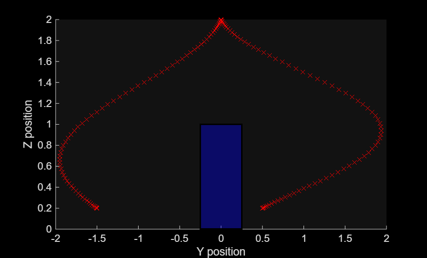
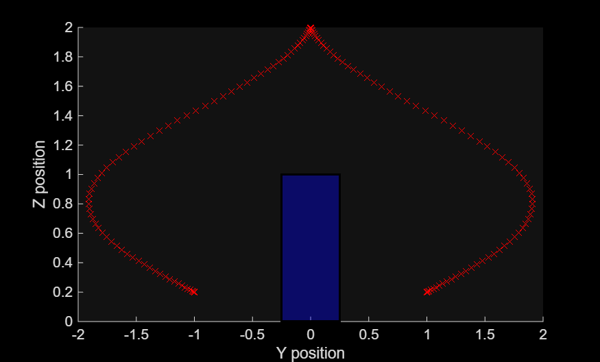
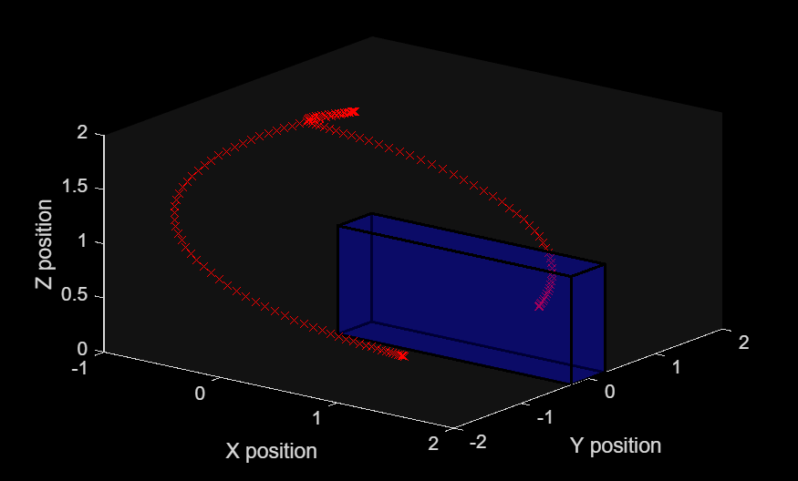
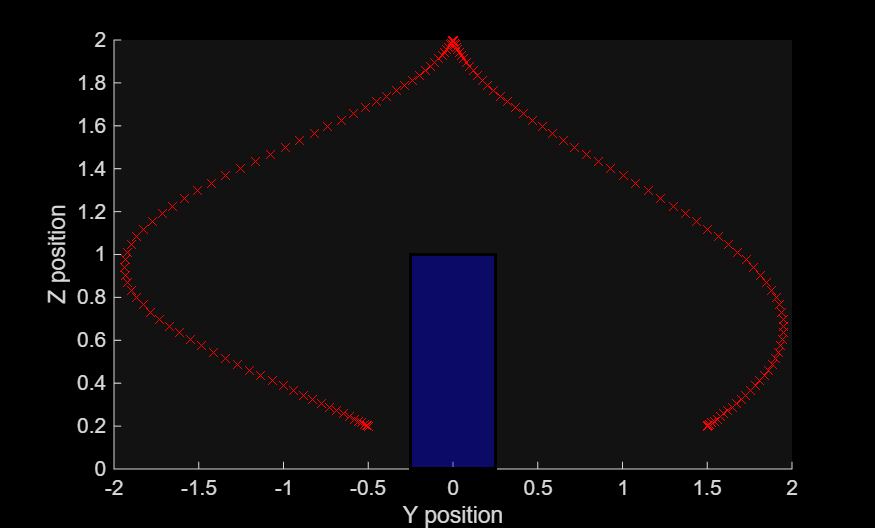
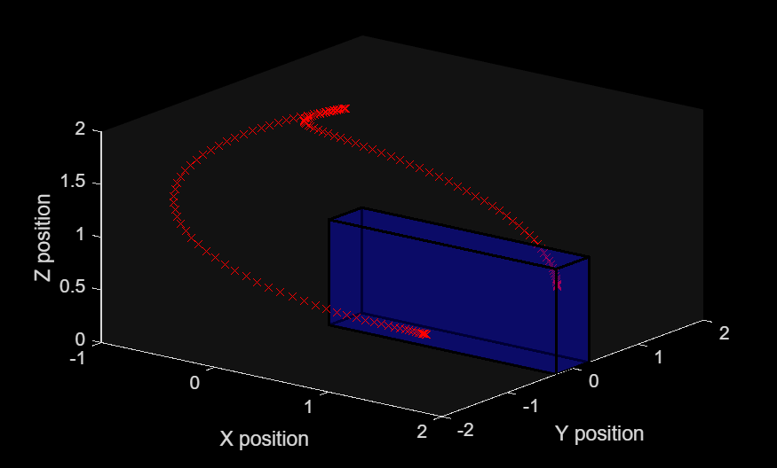

# PRR Manipulator Trajectory Planning with Obstacle Avoidance

**Pick and Place Task | Joint Space Trajectory Planning | Inverse Kinematics**

This project implements trajectory planning for a **PRR (Prismatic-Revolute-Revolute)** manipulator to perform pick-and-place tasks while avoiding an obstacle. The robot moves from an initial position to a goal position via a via-point, with trajectory planning performed in joint space.

## Overview

The manipulator uses a **Denavit-Hartenberg (DH)** parameterization to model forward kinematics. Inverse kinematics is solved numerically to find joint configurations that achieve desired end-effector poses. A linear trajectory is planned in joint space, and the resulting end-effector motion is visualized.

## Key Features

- DH parameter forward kinematics
- Numerical inverse kinematics with configurable mask
- Joint space trajectory planning (linear)
- Obstacle representation as rectangular prism
- Multiple view visualization
- Pick-and-place from 3 initial positions to 3 goals

## Robot Configuration

### DH Parameters

| Link | θ (rad) | d (m) | a (m) | α (rad) | Joint Type |
|------|---------|-------|-------|---------|-------------|
| 1 | 0 | 0 | q₁ | 0 | Prismatic (0) |
| 2 | 0 | L₁ = 0.5 | 0 | q₂ | Revolute (1) |
| 3 | 0 | L₂ = 1.0 | 0 | q₃ | Revolute (1) |
| 4 | 0 | L₃ = 1.0 | 0 | 0 | Fixed |

### Joint Variables

| Joint | Type | Variable | Range (example) |
|-------|------|----------|-----------------|
| Joint 1 | Prismatic | q₁ (m) | 0.2 |
| Joint 2 | Revolute | q₂ (rad) | 45° → π/4 |
| Joint 3 | Revolute | q₃ (rad) | 60° → π/3 |

## Pick and Place Locations

### Initial Positions (Object Locations)

| Object | X (m) | Y (m) | Z (m) |
|--------|-------|-------|-------|
| 1 | 1.0 | 0.5 | 0.2 |
| 2 | 1.0 | 1.0 | 0.2 |
| 3 | 1.0 | 1.5 | 0.2 |

### Goal Positions (Drop Locations)

| Goal | X (m) | Y (m) | Z (m) |
|------|-------|-------|-------|
| 1 | 1.0 | -1.5 | 0.2 |
| 2 | 1.0 | -1.0 | 0.2 |
| 3 | 1.0 | -0.5 | 0.2 |

### Via Point (Obstacle Avoidance)

| Parameter | Value |
|-----------|-------|
| X | 0 m |
| Y | 0 m |
| Z | 2 m |

## Obstacle Representation

A rectangular prism (obstacle or workspace boundary) is centered at:

| Parameter | Value |
|-----------|-------|
| Center (X, Y, Z) | (1, 0, 0.5) |
| X length | 2.0 m |
| Y length | 0.5 m |
| Z length | 1.0 m |

## Function Descriptions

| Function | Purpose |
|----------|---------|
| `DH_robot(DH_para)` | Computes transformation matrix from DH parameters |
| `DH_jacobian(DH_para, joint_types)` | Computes Jacobian matrix |
| `get_pose(DH, q)` | Returns end-effector pose for given joint config |
| `inverse_kinematics(DH, Jacob, target_pose, initial_q, mask)` | Numerically solves IK using Jacobian |
| `trajectory_planning(q0, q0_dot, q1, q1_dot, q_mid, t1)` | Generates linear joint space trajectory |

### Plots

## Dependencies

- MATLAB R2020b or later
- Symbolic Math Toolbox (for symbolic DH calculations)
- No external toolboxes required for core functions
